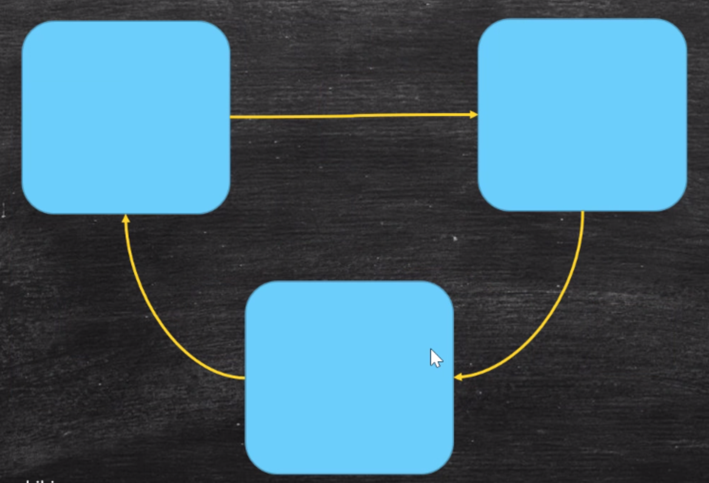

## jvm架构

### 学习资料

* jvm spec: https://docs.oracle.com/javase/specs/jvms/se8/jvms8.pdf

## GC的基础知识

### 什么是垃圾

1. 在c c++ java中是如何申请内存, 又是如何回收的呢?
    - c语言申请内存: malloc  / free
    - c++ : new / delete
    - java : new / 无
    - java采用的是自动回收机制
2. 手动回收和自动回收
    - 自动回收: 编程简单, 系统部容易出错, 但相对效率较低
    - 手动回收: 编程复杂, 容易出现以下两类问题, 但效率高
        - 忘记回收
        - 多次回收
3. 那么什么是GC呢? 
* 没有任何引用指向的一个对象或者一堆对象. 
* 栈空间里有一个对象, 这个对象new出来了一个成员变量, 这个变量指向了另外一个对象. 当我们把这个成员变量设置为null, 这时, 这个对象就变成垃圾.
* 还有一种, 多个对象互相之间有引用, 但是, 没有任何引用指向它, 那么, 他也是垃圾. 是一堆垃圾

### 如何定位垃圾

1. Reference Count: 引用计数
* 在一个对象上标记数字, 有几个对象引用他了. 比如现在有3个, 这标记为3. 直到对象标记为0, 则认为他是一个垃圾
* 引用计数存在的问题: 当一堆对象, 彼此相互引用, 他们的计数始终都不为0, 但是他们没有被其他对象引用, 是一堆垃圾, 通过引用计数没法判断, 所以, 又有下面这种计数方式--根可达算法
2. Root Searching根可达算法:

* 通过程序找到根对象, 通过跟对象找到关联的对象, 这些都不是垃圾, 其他的都是垃圾. 
* 根对象指的是什么呢?
    - 程序运行, 会有一个main方法, 这个肯定不是垃圾. 
    - 线程栈里的局部变量, 静态变量, 常量池, JNI指针引用到的变量.
    - jvm 文档给出的哪些对象是根对象呢? 
        - JVM stack(栈对象), 
        - native method(本地方法栈), 
        - run-time constant(常量池), 
        - static references in method area(静态方法区),
        - Clazz(内存中的class)

### 常见的垃圾回收算法

1. Mark Sweep标记清除:

标记黑色可回收的对象然后清除。 \
优点是速度快。 缺点, 从清除后的图像可以看出, 内存被分成了一小块一小块, 有碎片

2. copy拷贝:

* 将内存一分为二: 然后将第一部分的存活对象全部拷贝到第二部分. 在对第一部分整体清除.
* 拷贝的速度是很快的, 缺点是耗费内存. 本来5G空间就足够了, 但是用标记清楚, 就要配备10G的内存. 

3. Mark Compact标记压缩:

* 将可回收对象标记出来, 然后把后面的存活对象拷贝到可回收的位置, 在做标记和清除的过程中, 做了压缩和整理.
* 好处是有用的对象放一块, 可以有整块的空间, 资源也得到了充分的利用. 缺点是: 效率偏低.

### JVM分代内存模型

1. 新生代New + 老年代Old + Metaspace (永久代(1.7) / 元数据区(1.8) )
    - 永久代和元数据都是装class
    - 永久代必须指定大小限制, 元数据可以限制, 也可以不限制,无上限(受限于物理内存)
    - 字符串常量 1.7-永久代, 1.8-元数据
2. 新生代 = Eden + 2个survivor . 对新生代对象的回收叫YGC.
    - YGC回收后,大多数会被回收. 活着的对象进入s1
    - 再次YGC, 将Eden+s1对象copy到s2, 然后清空.
    - 再次YGC, Eden + s2 对象 copy到s1, 以此循环
    - 年龄达到一定阶段, 直接放入老年代.
    - 如果大对象s2放不下,直接进入老年代.
3. 老年代: 
    - 装的顽固分子
    - 垃圾回收叫FGC
4. GC tuning(Generation) GC调优, 调什么呢?
    - 尽量减少FGC \

　　概念: MinorGC 就是 YGC; MajorGC 就是 FGC

### 垃圾回收器

红线圈出的是分代模型, 上面是新生代使用的模型, 下面是老年代使用的模型, 右侧跨在中间的不再区分新生代和老年代. \
线上运行的系统, 多数是红线圈出的部分. 所以我们调优也是针对这部分. 仔细看, 新生代和老年代中间有虚线, 虚线代表组合.

#### Serial : 串行回收

> a stop-the-world， copying collector which uses a single GC thread.

当要进行gc回收. 所有用户线程都要停止, gc回收线程是单线程. gc回收完, 继续执行用户线程, 依次循环

* Serial: 使用在新生代
* Serial Old: 使用在老年代

#### Parallel Scavenge: 并行回收

> a stop-the-world, copying collector which uses multiple GC threads

和Serial并行回收对比, 垃圾回收采用的是多线程并行回收. 效率比单线程高

* Parallel Scavenge: 用在新生代
* Parallel Old: 用在老年代

#### ParNew: 配合CMS的并行回收, 应用在年轻代
> - a stop-the-world, copying collector which uses multiple GC threads
> - it differs from 'Parallel Scavenge' in that it has enhancements that make it usable with CMS
> - for example, "ParNew" does the synchonization needed so that it can run during the concurrent phases of CMS.

他也是并行回收, 那么他和Parallel Scavenge的区别是什么呢? 看hotspot给出的, 重点在于ParNew可以和CMS配合使用

#### ConcurrentMarkSweep: 简称CMS. 
- 应用在老年代
- 在垃圾回收的过程中, 应用程序也能运行. 所以叫做并行。具体细节叫三色标记法，错标-> incremental update （写屏障) -> remark
- 这个回收机制也存在各种问题, 他存在的意义是一个承上启下的过度, 由此产生了下面几种回收机制.

#### G1:(10ms)
#### ZGC: (1ms): 可以pk c++
#### Shenandoah:
#### Epsilon 
- 啥也不干 （调试，确认不用GC参与就能干完活)。

### notes
- 1.8默认的垃圾回收器是PS + Parallel Old. 我们使用的时候很少去手动设置