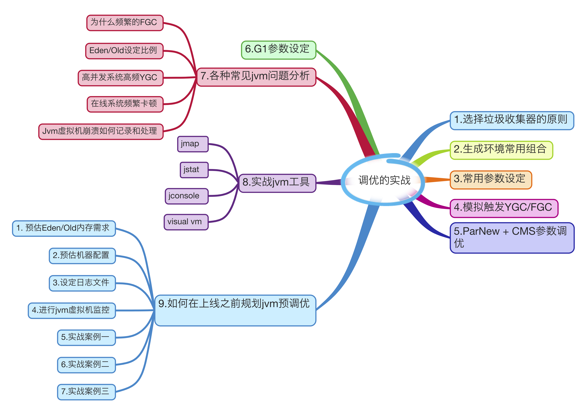

### jvm调优



### jvm参数

1. JVM命令参数分类
    - 标准参数: -开头, 所有的HotSpot都支持, 例如: 
    ```
    java -version
    ```
    - 非标准参数: -X开头, 特定版本的HotSpot支持 \
　　  在命令行输出 java -X 可以查看到非标参数
    - 不稳定参数: -XX开头, 下个版本可能取消 

```
java -version
java -X //可以查看到非标参数
java -XX:+PringFlagsWithComments  // 只有debug版本 能用
java -XX:+PrintFlagsFinal
java -XX:+PrintFlagsInitial
java -XX:+PrintCommandLineFlags   // 查看在生产环境中jvm使用了哪些参数. 不会影响线上程序的运行.
java -XX:+PrintGC
```

执行 <code>java -XX:+PrintCommandLineFlags</code> 的输出介绍
- InitialHeapSize :初始堆大小
- -XX: MaxHeapSize : 堆最大大小
- -XX:+PrintCommandLIneFlags : 我当前执行的命令
- -XX:+UseCompressedClassPointers : 压缩指针
- -XX:UseCompressedOops : 压缩对象
- -XX: +UseParallelGC : 使用的GC是ParallelGC. 使用的就是(Parallel Scavenge + Parallel Old) .

### 堆设置
1. 首先是操作系统的选择，在32位操作系统下JVM 只支持最大2GB Heap 大小，所以这大大的局限了程序的运行性能。然而在64位操作系统下则没有任何限制，所以推荐使用64位操作系统。
2. 然后是硬件方面，可以根据经济情况相应增加CPU 数量及物理内存大小，这样利用并行收集器可以带来很高的垃圾清理效率。
3. Heap 相关参数设置，大型的应用系统常常会被两个问题困扰：一个是启动缓慢，因为初始Heap 非常小，必须由很多major 收集器来调整内存大小；另一个更加严重的问题就是默认的Heap 最大值对于应用程序来说“太可怜了”。根据以下经验法则(即拇指规则，指根据经验大多数情况下成立，但不保证绝对)：
    - 给于虚拟机更大的内存设置，往往默认的64mb 对于现代系统来说太小了。
    - 将-Xms 与-Xmx 设置为相同值，这样做的好处是GC 后不用再频繁的根据内存使用情况去动态修改Heap 内存大小了，而且只有当内存使用达到-Xmx 设置的最大值时才会触发垃圾收集，这给GC 及系统减轻了负担。
    - 设置过堆大小之后，可以根据程序创建对象的频率来调整新生代的内存大小，如果程序中创建新对象的频率比较搞可以适当调大新生代，但不要盲目调整，因为新生代的大小对JVM 及系统性能影响较大，Java 官方推荐配置为整个堆大小的3/8，此值可以通过非标准参数-Xmn 直接调整大小或不稳定参数-XX:NewRatio=2 间接调整新生代与老年代的大小比值。
    - 线程中栈的大小调整也是如此，需要比较谨慎及细致的测试之后修改。

```
-Xms：初始堆(Heap)大小，默认3670k。当空闲堆内存小于40%时，JVM 就会增大堆内存直到-Xmx 所设置的最大值，可以通过-XX:MinHeapFreeRatio=n 设置其比例。
-Xmx：最大堆(Heap)大小，默认64m。当空闲堆内存大于70%时，JVM 会减少堆内存直到-Xms 所设置的最小值，可以通过-XX:MaxHeapFreeRatio=n 设置其比例。
-Xmn：新生代大小，增大新生代后会相应减小老年代大小。此值对系统性能影响较大，Java 官方推荐配置为整个堆大小的3/8。
-Xss：设置每个线程栈的大小。Java1.5 以后每个线程栈默认大小为1M，之前每个线程栈默认大小为256K。可以根据应用的线程所需内存大小进行调整。一般情况下默认值已经能满足绝大部分情景的应用，如果想更进一步优化则需要非常细致的测试。在相同物理内存下，减小这个值能生成更多的线程，进程中可容纳线程数量与很多因素有关，感兴趣的可以详细了解下，据说可以达到6500个以上。

-XX:MinHeapFreeRatio=40：如果发现空闲堆内存占到整个预估上限值的40%，则增大上限值。
-XX:MaxHeapFreeRatio=70：如果发现空闲堆内存占到整个预估上限值的70%，则收缩预估上限值。
-XX:NewRatio=2：设置年轻代和老年代的比值。例如：n=3，则表示年轻代与老年代比值为1:3，年轻代占整个年轻代与老年代之和的1/4。
-XX:SurvivorRatio=8：Eden 与Survivor 的占用比例。例如8表示，一个survivor 区占用 1/8 的Eden 内存，即1/10的新生代内存，此处需注意年轻代有2个survivor 区，所以比例为1:10。
-XX:TargetSurvivorRatio=50：实际使用的survivor 空间大小占比。默认是47%，最高90%。
-XX:MaxPermSize=64m：设置持久代(即方法区)占整个堆内存的最大值。
-XX:MaxTenuringThreshold=0：设置对象最大年龄。即对象在在Eden 与Survivor 区之间被复制的次数，每被复制一次就增加1岁，默认值为15。如果设置为0的话，则Eden 中对象不经过Survivor 区直接进入老年代。
```

### gc收集器设置 
```
-XX:+UseSerialGC:设置串行收集器 
-XX:+UseParallelGC:设置并行收集器 
-XX:+UseParalledlOldGC:设置并行年老代收集器 
-XX:+UseConcMarkSweepGC:设置并发收集器

-XX:-DisableExplicitGC：禁止在运行期显式地调用System.gc()，开启该选项后，GC 的触发时机将由Garbage Collector 全权掌控，默认：关闭。
-XX:+ScavengeBeforeFullGC：在Full GC前触发一次Minor GC，默认：启用。
-XX:+UseGCOverheadLimit：限制GC的运行时间。如果GC耗时过长，就抛OutOfMemoryError。
-XX:ParallelGCThreads=n：配置并行收集器的线程数，即：同时多少个线程一起进行垃圾回收。此值最好配置与处理器数目相等。
-XX:+UseTLAB：启用线程本地缓存区(Thread Local)。
```

### 垃圾回收统计信息
```
-XX:+PrintGC：开启GC日志打印。
-XX:+PrintGCDetails：打印GC回收的详细信息。
-XX:+PrintGCTimeStamps：打印GC停顿耗时。 
-Xloggc:<filename>：输出GC 详细日志信息至指定文件。
-XX:+UseGCLogFileRotation：开启GC 日志文件切分功能，前置选项 -Xloggc。
-XX:NumberOfGClogFiles=1：设置切分GC 日志文件数量，文件命名格式：.0, .1, ..., .n-1。
-XX:GCLogFileSize=8K：GC日志文件切分大小。
```

### 并行收集器设置 
```
-XX:ParallelGCThreads=n:设置并行收集器收集时使用的CPU数.并行收集线程数. 
-XX:MaxGCPauseMillis=n:设置并行收集最大暂停时间 
-XX:GCTimeRatio=n:设置垃圾回收时间占程序运行时间的百分比.公式为1/(1+n)
```
