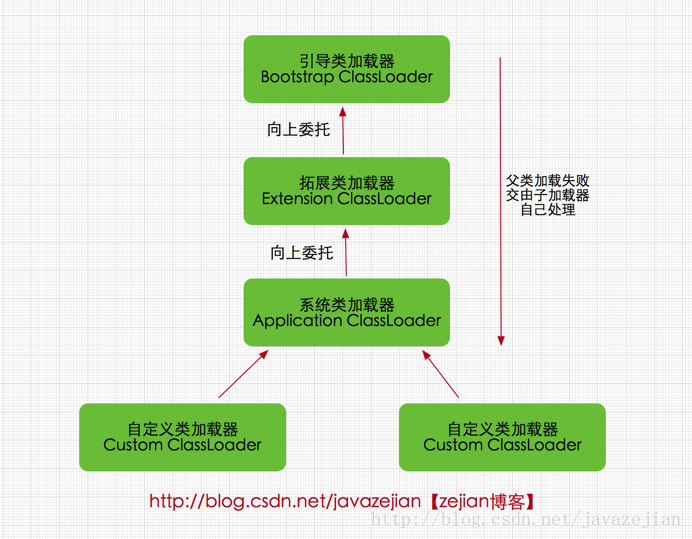

# 类加载
JVM如果想执行相关的业务逻辑，是通过java的class文件进行读取。JVM用来存储加载的类信息，常量，静态变量，编译后的代码等数据，虚拟机规范中这是一个逻辑区划。具体实现根据不同虚拟机来实现。Hotspot在jdk7中方法区放在了永久区，jdk8放在元数据空间，并且通过GC机制对这个区域进行管理。


## 为什么需要类加载
- 和c不同，编译之后没有link的过程
- link的过程就是在类加载的时候完成
- java程序可以装载在编译时并不知道或者尚未存在的类或者接口，并动态链接他们
- 动态加载: 只在需要时候的加载，不是一开始全部加载
- java类文件并不一定真的是一个磁盘文件，可以来自网络，甚至可以来自内存

## java类加载步骤


- loading 找到类的二进制字节流
- linking 
    - 校验(verification) 目的在于确保Class文件的字节流中包含信息符合当前虚拟机要求，不会危害虚拟机自身安全。主要包括四种验证，文件格式验证，元数据验证，字节码验证，符号引用验证。
    - 准备(preparation) 为类变量(即static修饰的字段变量)分配内存并且设置该类变量的初始值即0(如static int i=5;这里只将i初始化为0，至于5的值将在初始化时赋值)，这里不包含用final修饰的static，因为final在编译的时候就会分配了，注意这里不会为实例变量分配初始化，类变量会分配在方法区中，而实例变量是会随着对象一起分配到Java堆中。
    - 解析（resolution) 主要将常量池中的符号引用替换为直接引用的过程。符号引用就是一组符号来描述目标，可以是任何字面量，而直接引用就是直接指向目标的指针、相对偏移量或一个间接定位到目标的句柄。有类或接口的解析，字段解析，类方法解析，接口方法解析(这里涉及到字节码变量的引用，如需更详细了解，可参考《深入Java虚拟机》)。
- 初始化(initilization)
    - 类加载最后阶段，若该类具有超类，则对其进行初始化，执行静态初始化器和静态初始化成员变量(如前面只初始化了默认值的static变量将会在这个阶段赋值，成员变量也将被初始化)。

## 类初始化时机
- new, getstatic, putstatic, invokestatic
- 使用java.lang.reflect包的方法对类进行反射调用的时候
- 当虚拟机启动时，用户需要制定一个要执行的主类,main 方法，虚拟机会先初始化这个主类

## 类加载器
类加载器的任务是根据一个类的全限定名来读取此类的二进制字节流到JVM中，然后转换为一个与目标类对应的java.lang.Class对象实例，在虚拟机提供了3种类加载器，引导（Bootstrap）类加载器、扩展（Extension）类加载器、系统（System）类加载器（也称应用类加载器）

### 启动（Bootstrap）类加载器
启动类加载器主要加载的是JVM自身需要的类，这个类加载使用C++语言实现的，是虚拟机自身的一部分，它负责将 <JAVA_HOME>/lib路径下的核心类库或-Xbootclasspath参数指定的路径下的jar包加载到内存中，注意必由于虚拟机是按照文件名识别加载jar包的，如rt.jar，如果文件名不被虚拟机识别，即使把jar包丢到lib目录下也是没有作用的(出于安全考虑，Bootstrap启动类加载器只加载包名为java、javax、sun等开头的类)。

### 扩展（Extension）类加载器
扩展类加载器是指Sun公司(已被Oracle收购)实现的sun.misc.Launcher$ExtClassLoader类，由Java语言实现的，是Launcher的静态内部类，它负责加载<JAVA_HOME>/lib/ext目录下或者由系统变量-Djava.ext.dir指定位路径中的类库，开发者可以直接使用标准扩展类加载器。
```java
//ExtClassLoader类中获取路径的代码
private static File[] getExtDirs() {
     //加载<JAVA_HOME>/lib/ext目录中的类库
     String s = System.getProperty("java.ext.dirs");
     File[] dirs;
     if (s != null) {
         StringTokenizer st =
             new StringTokenizer(s, File.pathSeparator);
         int count = st.countTokens();
         dirs = new File[count];
         for (int i = 0; i < count; i++) {
             dirs[i] = new File(st.nextToken());
         }
     } else {
         dirs = new File[0];
     }
     return dirs;
 }
```
### 系统（System）类加载器
也称应用程序加载器是指 Sun公司实现的sun.misc.Launcher$AppClassLoader。它负责加载系统类路径java -classpath或-D java.class.path 指定路径下的类库，也就是我们经常用到的classpath路径，开发者可以直接使用系统类加载器，一般情况下该类加载是程序中默认的类加载器，通过ClassLoader#getSystemClassLoader()方法可以获取到该类加载器。\
　 在Java的日常应用程序开发中，类的加载几乎是由上述3种类加载器相互配合执行的，在必要时，我们还可以自定义类加载器，需要注意的是，Java虚拟机对class文件采用的是按需加载的方式，也就是说当需要使用该类时才会将它的class文件加载到内存生成class对象，而且加载某个类的class文件时，Java虚拟机采用的是双亲委派模式即把请求交由父类处理，它一种任务委派模式，下面我们进一步了解它。

##  双亲委派类加载机制

\
\
\
\
\
双亲委派模式是在Java 1.2后引入的，其工作原理的是，如果一个类加载器收到了类加载请求，它并不会自己先去加载，而是把这个请求委托给父类的加载器去执行，如果父类加载器还存在其父类加载器，则进一步向上委托，依次递归，请求最终将到达顶层的启动类加载器，如果父类加载器可以完成类加载任务，就成功返回，倘若父类加载器无法完成此加载任务，子加载器才会尝试自己去加载，这就是双亲委派模式 \
采用双亲委派模式的是好处是Java类随着它的类加载器一起具备了一种带有优先级的层次关系，通过这种层级关可以避免类的重复加载，当父亲已经加载了该类时，就没有必要子ClassLoader再加载一次。其次是考虑到安全因素，java核心api中定义类型不会被随意替换，假设通过网络传递一个名为java.lang.Integer的类，通过双亲委托模式传递到启动类加载器，而启动类加载器在核心Java API发现这个名字的类，发现该类已被加载，并不会重新加载网络传递的过来的java.lang.Integer，而直接返回已加载过的Integer.class，这样便可以防止核心API库被随意篡改。可能你会想，如果我们在classpath路径下自定义一个名为java.lang.SingleInterge类(该类是胡编的)呢？该类并不存在java.lang中，经过双亲委托模式，传递到启动类加载器中，由于父类加载器路径下并没有该类，所以不会加载，将反向委托给子类加载器加载，最终会通过系统类加载器加载该类。但是这样做是不允许，因为java.lang是核心API包，需要访问权限，强制加载将会报出如下异常,所以无论如何都无法加载成功的.
```java
java.lang.SecurityException: Prohibited package name: java.lang
```

## References
- https://blog.csdn.net/javazejian/article/details/73413292