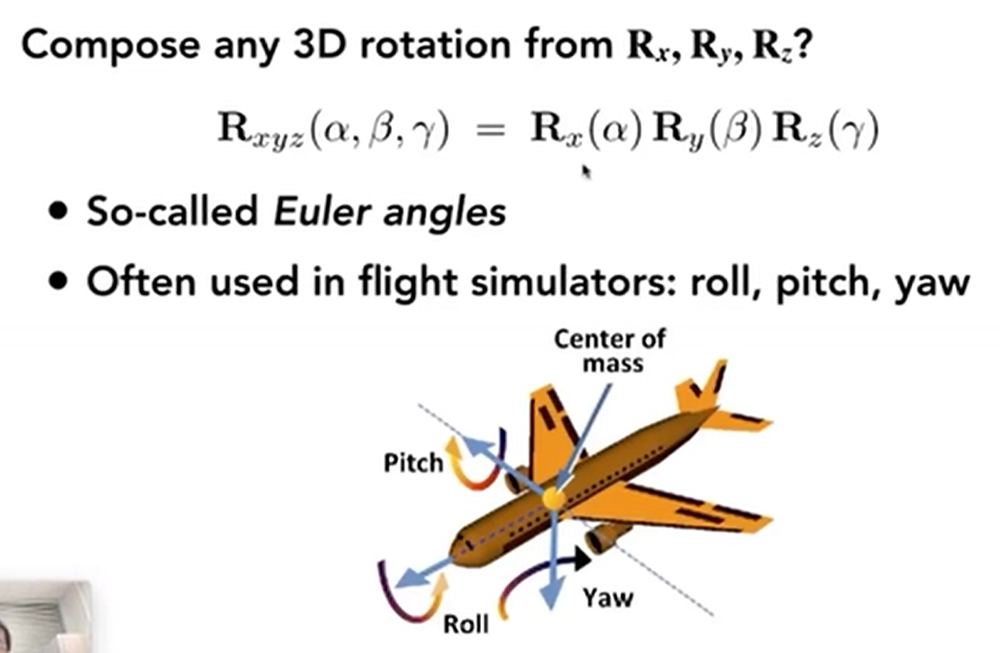
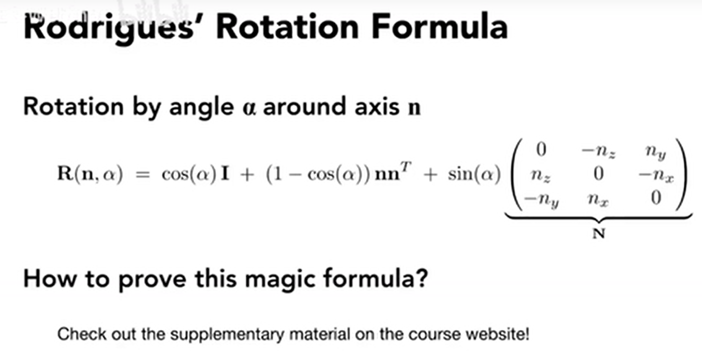

入过一个矩阵的逆等于转置，那么这个矩阵式正交矩阵

一个旋转的矩阵的逆就是它的转置。

```
├── 3d transformations
├── viewing transformation
|   ├── view/camera transformation
|   └── projection transformation 
|       ├── orthographic projection  （正交)        
|       └── perspective projection （透视)
```

### 3d transformations
point (x,y,z,1)
vector (x,y,z,0)


#### 绕轴旋转







### viewing transformation
#### camera transformation
3d to an image in 2d


##### define camera
- position, e, 
- gaze, g, where to look at
- up, 向上方向


always transform the camera to the origin, up at Y, look at -z


#### projection transformation
##### orthographic projection
##### perspective projection


### references
- the fundamentals of computer graphics, 4th edition
